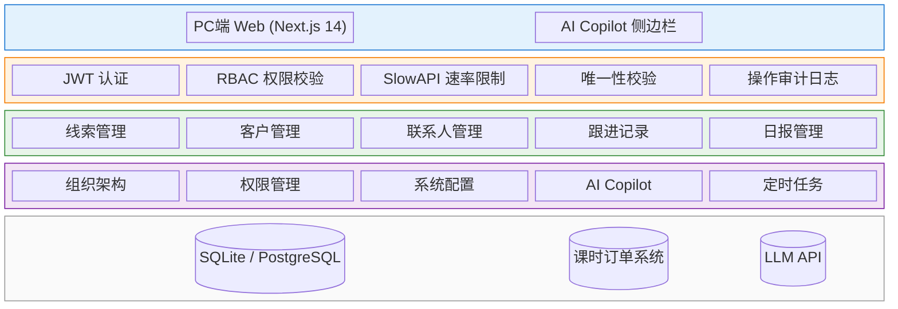
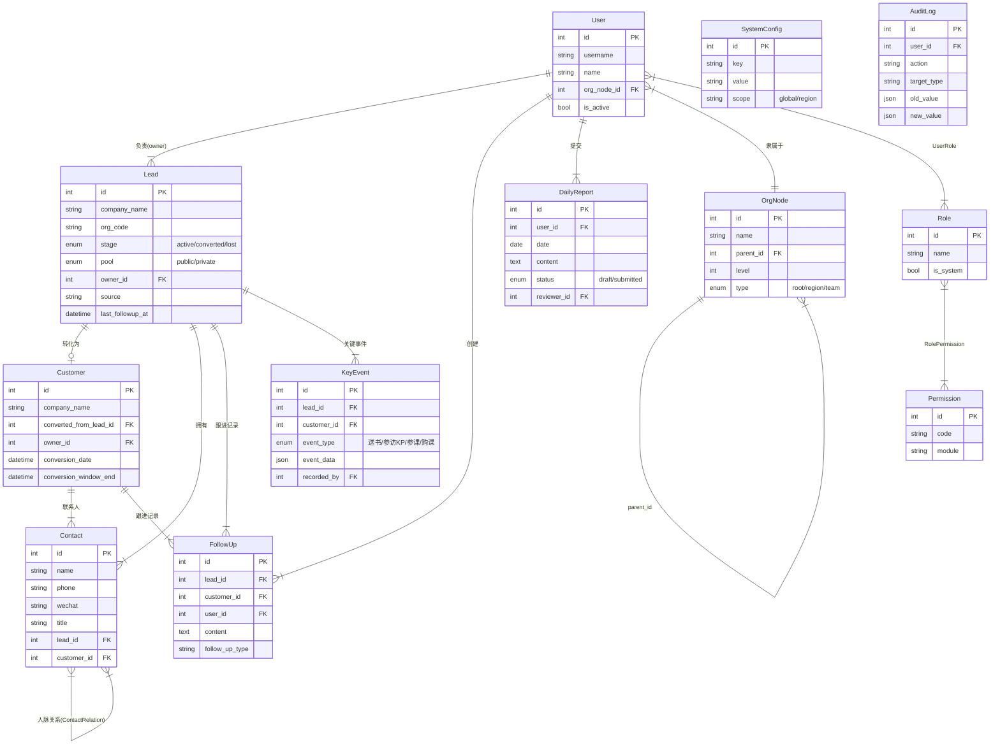
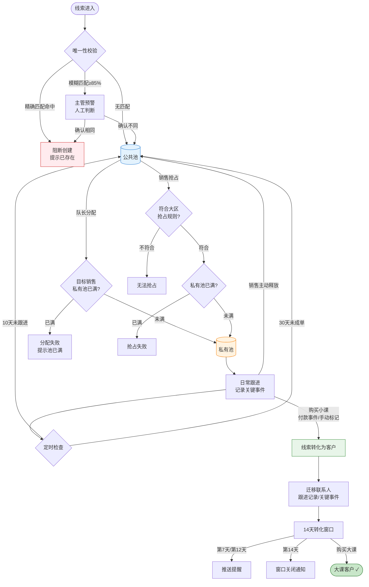
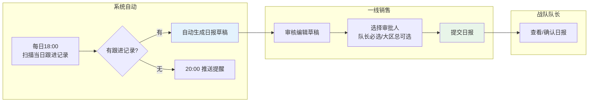
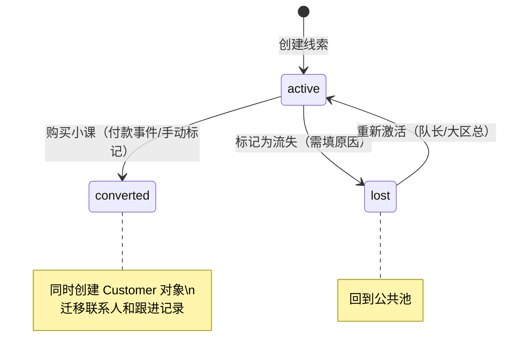
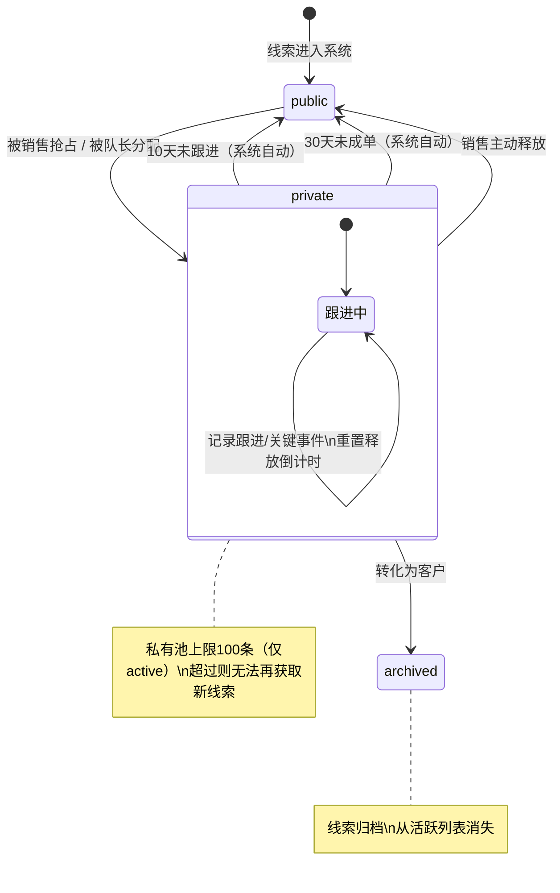
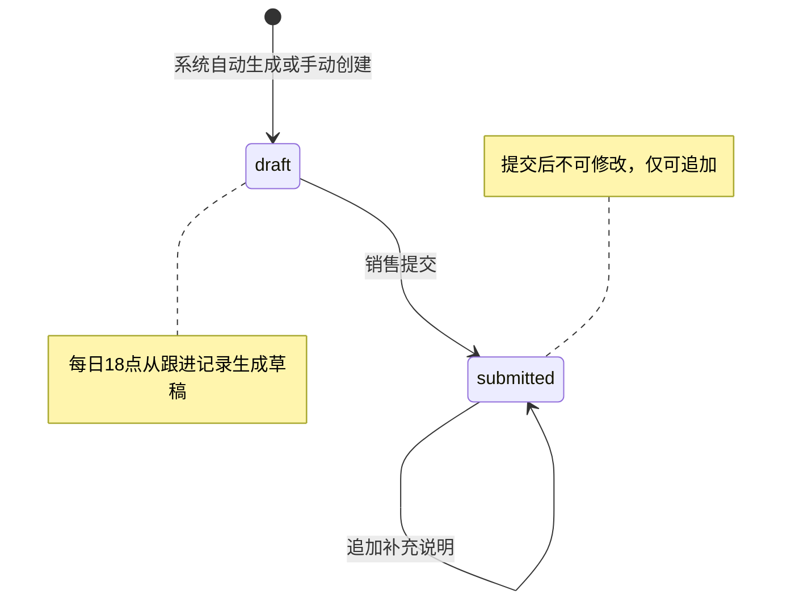

# SFA CRM 系统 PRD

| PRD 审核人 | [TODO: 请指定] |
| --- | --- |
| 重要性 | 高 |
| 紧迫性 | 高 |
| 需求方 | 销售VP |
| PRD 编写人 | 杨堃 |
| PRD 提交日期 | 2026-04-03 |

## PRD 修改记录

| 变更时间 | 变更内容 | 变更提出部门与理由 | 修改人 | 审核人 | 版本号 |
| --- | --- | --- | --- | --- | --- |
| 2026-04-03 | 初始版本 | — | 杨堃 | [TODO] | v1.0 |

---

## 产品定型

| 维度 | 定型结果 |
| --- | --- |
| **商业属性** | 企业自研系统 |
| **功能类型** | 业务型管理软件 |
| **文档范围** | 0-1 新系统设计 |
| **是否涉及 AI** | 是（AI Copilot） |

---

## 1、项目背景

> 💡 方法论提示：《决胜B端》三层业务调研框架（战略层→战术层→执行层）

### 1.1 业务现状

公司是一家企业家培训机构，拥有约200人的销售团队，按地域划分为5大区（华北/华南/华东/华中/西南），组织结构为：销售VP → 大区总（5人）→ 战队队长（约30人）→ 一线销售（约150人）。

核心产品线包含两类课程：
- **小课**：3天2夜线下课程，定价2万元，是客户进入体系的主要入口和转化漏斗
- **大课**：半年制企业家MBA课程，定价20万元，是核心收入来源

业务特征：大课直购极少，绝大多数客户通过"小课体验→大课转化"的路径完成购买。因此，**线索到小课客户的转化效率**直接决定公司营收。

当前销售团队使用的工具分散在多个系统中，缺少统一的客户资源管理平台，线索分配、跟进记录、日报管理等核心流程缺乏系统支撑。

### 1.2 面临问题

按影响范围×严重程度×紧迫度排序：

1. **资源配置低效**：好线索无法精准分配给合适的销售，缺乏科学的线索分配机制，整体转化率受损——这是直接影响营收的核心痛点。
2. **数据质量差**：销售填报数据不准确，客户唯一性无法保证，存在大量垃圾数据和重复录入，导致管理层无法基于数据做决策。
3. **防护漏洞**：已出现销售使用"按键精灵"等外挂工具疯狂抢占公共池线索的情况，严重破坏公平性。
4. **操作效率低**：拜访记录和日报需要重复录入，销售抱怨频繁，影响一线使用积极性。
5. **业绩预测困难**：无法准确预测销售业绩，难以区分销售能力问题和态度问题，管理决策缺乏依据。
6. **流程分散**：送书、参访KP、参课购课等关键销售动作分散在多个系统和Excel中，无法形成完整的客户跟进画像。

### 1.3 解决思路

建设一套统一的 SFA CRM 系统，核心策略：

1. **统一客户资源池**：建立公共池/私有池双池机制，通过唯一性校验和模糊匹配防止重复，从源头保障数据质量。
2. **智能分配与自动释放**：通过可配置的分配规则和自动释放机制（未跟进/未成单超时自动回收），激活库存线索，最大化资源利用率。
3. **一站式跟进管理**：将跟进记录、关键事件、日报统一到一个平台，日报从跟进记录自动生成，消除重复录入。
4. **AI Copilot 赋能**：引入 AI 助手辅助销售进行信息整理、规律识别、下一步建议，提升一线销售的工作效率和决策质量。
5. **配置驱动**：所有业务规则参数（池上限、释放天数、抢占规则等）可在线配置，支持按大区差异化管理。

### 1.4 决策依据

- 200人销售团队日常操作缺乏系统支撑，人均每天约30分钟浪费在重复录入和系统切换上
- 已发生外挂抢线索事件，公平性问题如果不解决将严重影响团队士气
- 小课转化率是核心营收杠杆，线索分配效率每提升10%可能带来数百万级别的营收增量
- 业务规则在各大区存在差异（如抢占规则），需要配置化而非硬编码

---

## 2、需求基本情况

> 💡 方法论提示：《决胜B端》需求发现十三要素五步法

| 要素 | 内容 |
| --- | --- |
| **需求提出人** | 销售VP |
| **功能使用人** | 一线销售（约150人）、战队队长（约30人）、大区总（5人） |
| **受影响人** | 销售VP（全局数据）、系统管理员（维护配置）、培训运营团队（课程交付对接） |
| **场景描述** | 见下方详细场景 |
| **发生频率** | 每日高频使用（销售每天至少操作20-30次） |
| **核心痛点** | 销售团队无法高效管理和跟进线索，好资源被浪费，差资源占用精力 |
| **需求价值** | 提升线索分配精准度和跟进效率，最终提升小课→大课的转化率 |

### 核心场景描述

> 💡 场景六要素：人物、时间、地点、起因、经过、结果

**场景1：一线销售抢占公共池线索**
- **人物**：华北大区一线销售张三，入职半年
- **时间**：每日上午9:00，公共池新线索释放时间
- **地点**：办公室PC端
- **起因**：公共池释放一批新线索，张三需要补充私有池
- **经过**：张三打开公共池列表，快速浏览线索信息，点击"抢占"。但同时有十几个销售在抢，部分销售甚至使用按键精灵自动抢占
- **结果**：手速慢的销售长期抢不到好线索，使用外挂的销售占据大量资源但转化率不高，管理层无法干预

**场景2：队长分配线索给组员**
- **人物**：华南大区战队队长李四，管理8名销售
- **时间**：每周一上午
- **地点**：办公室PC端
- **起因**：市场部导入一批新线索到公共池，队长需要分配给合适的销售
- **经过**：李四查看线索基本信息（企业规模、行业、地区），根据经验判断哪个销售更擅长跟进此类客户，手动逐条分配
- **结果**：分配效率低，依赖队长个人经验，缺乏数据支撑；如果目标销售私有池已满，分配失败，需要先让销售释放线索

**场景3：销售跟进线索并记录关键事件**
- **人物**：一线销售王五，跟进一家目标企业
- **时间**：下午拜访客户后
- **地点**：移动端（拜访途中）或PC端（回到办公室）
- **起因**：王五刚完成一次上门拜访，给对方关键决策人（KP）送了书，需要记录
- **经过**：王五需要在系统中记录跟进内容、标记"送书"关键事件、备注对方反馈。然后到了傍晚还需要写日报，重复描述今天的拜访
- **结果**：日报内容与跟进记录高度重复，王五每天花20分钟写日报，极为抵触

**场景4：线索自动释放与再利用**
- **人物**：系统自动任务
- **时间**：每日凌晨定时扫描
- **地点**：系统后台
- **起因**：销售张三领取了一条线索后，连续10天未进行任何跟进记录
- **经过**：系统判定超过释放阈值（10天未跟进），自动将线索从张三的私有池释放回公共池
- **结果**：线索重新进入公共池，其他销售可以抢占或由队长重新分配，避免线索被"占着不跟"

---

## 3、业务分析与系统调研

> 💡 方法论提示：《决胜B端》三层业务调研（战术层重点）+ 同类系统参考

### 3.1 同类系统调研

| 调研对象 | 类型 | 核心能力 | 可借鉴点 | 局限性 |
| --- | --- | --- | --- | --- |
| Salesforce Sales Cloud | 外部 | 线索管理、商机管道、AI预测（Einstein） | 成熟的线索生命周期管理、公共池/私有池概念、AI赋能 | 过于通用，不贴合培训行业场景；定制成本高 |
| 纷享销客 | 外部 | 国内SFA、客户公海池、移动CRM | 公海池机制、跟进记录与日报联动 | 缺少AI能力、配置灵活度有限 |
| 销售易（Neocrm） | 外部 | B2B销售管理、连接型CRM | 企业级权限设计、多维度数据分析 | 教育培训行业适配不足 |
| 公司现有Excel+微信群管理 | 内部 | 基础的客户信息记录和手工分配 | 灵活性高、上手门槛低 | 无唯一性校验、无自动释放、无数据统计、不防外挂 |

### 3.2 业务痛点优先级

| 排序 | 痛点描述 | 影响范围 | 严重程度 | 紧迫度 | 涉及部门 |
| --- | --- | --- | --- | --- | --- |
| 1 | 线索分配不精准，好资源被浪费 | 全公司200人 | 高 | 高 | 销售管理 |
| 2 | 客户数据重复和质量差 | 全公司 | 高 | 高 | 销售+运营 |
| 3 | 外挂抢线索破坏公平性 | 全公司 | 高 | 紧急 | 销售 |
| 4 | 日报与跟进记录重复录入 | 一线销售150人 | 中 | 中 | 销售 |
| 5 | 业绩预测无数据支撑 | 管理层 | 中 | 中 | 销售管理 |
| 6 | 关键销售动作分散无法追踪 | 全公司 | 中 | 中 | 销售+运营 |

### 3.3 投入产出初步评估

| 维度 | 估算 |
| --- | --- |
| **预计投入** | 产品+研发团队，预计3-4个月开发周期 |
| **效率提升** | 日报自动生成预计为每位销售每天节省20分钟；线索分配从手工改为系统化，队长分配效率提升50%以上 |
| **业务价值** | 线索转化率若提升5-10%，按年度线索量和客单价估算，预计带来显著营收增量 |

---

## 4、项目收益目标

> 💡 方法论提示：SMART原则（具体、可衡量、可实现、相关性、有时限）

### 4.1 项目目标

| 目标类型 | 目标描述 | 衡量指标 | 目标值 | 达成时限 |
| --- | --- | --- | --- | --- |
| **核心业务目标** | 提升线索到小课客户的转化率 | 线索→小课转化率 | 较上线前提升10% | 上线后6个月 |
| **效率目标** | 消除日报重复录入 | 日报自动生成使用率 | ≥80%的销售使用自动生成功能 | 上线后3个月 |
| **效率目标** | 提升线索分配效率 | 队长平均分配耗时 | 较当前降低50% | 上线后3个月 |
| **数据质量目标** | 消除重复线索 | 重复线索占比 | <2% | 上线后1个月 |
| **安全目标** | 杜绝外挂抢线索 | 外挂触发拦截率 | 100% | 上线即生效 |

### 4.2 验收标准

1. 全部8个核心功能模块（线索管理、客户管理、联系人管理、跟进记录、日报管理、组织与权限、系统配置、AI Copilot）功能完整可用
2. 线索唯一性校验（精确匹配+模糊匹配）准确率 ≥95%
3. 自动释放机制按配置正确触发
4. 速率限制有效拦截异常抢占行为
5. 权限体系覆盖所有页面和操作，数据权限按组织架构树正确隔离

### 4.3 成功标准

> 项目上线后3个月内，达到以下指标视为成功：

1. 销售团队日活率 ≥85%（200人中至少170人每日登录使用）
2. 日报自动生成功能采纳率 ≥80%
3. 线索→小课转化率较上线前提升 ≥5%
4. 销售对系统满意度调研 NPS ≥30

---

## 5、项目方案概述

> 💡 方法论提示：《决胜B端》自顶向下设计 — 先全景后细节

### 5.1 核心功能概述

| 序号 | 功能模块 | 功能简述 | 优先级 |
| --- | --- | --- | --- |
| 1 | 线索管理 | 公共池/私有池双池机制，含唯一性校验、自动释放、抢占/分配 | P0 |
| 2 | 客户管理 | 线索转化为客户，14天转化窗口追踪，客户画像 | P0 |
| 3 | 联系人管理 | 企业联系人维护，跨企业人脉关系网络 | P0 |
| 4 | 跟进记录 | 销售拜访记录和关键事件（送书/参访KP/参课/购课）结构化管理 | P0 |
| 5 | 日报管理 | 从跟进记录自动生成日报草稿，队长审批流程 | P1 |
| 6 | 组织与权限 | 树形组织架构，RBAC功能权限+数据权限分离 | P0 |
| 7 | 系统配置 | 所有业务阈值可在线配置（池上限、释放天数、抢占规则等） | P0 |
| 8 | AI Copilot | 智能助手：信息整理、规律识别、下一步建议、Tool Use调用业务API | P1 |

### 5.2 方案概述

- **产品方案**：以线索生命周期管理为核心主线，串联"线索→跟进→客户→大课转化"全链路；所有业务规则配置驱动，支持按大区差异化管理
- **技术方案**：前后端分离架构（Next.js 14 + FastAPI），SQLite 数据库（支持迁移至 PostgreSQL），JWT 认证，Docker Compose 部署
- **运营方案**：分大区试点上线，从核心痛点（线索管理+日报）切入，逐步扩展至全功能

### 5.3 MVP 范围

> 💡 B端 MVP 原则：必须支撑核心业务流程闭环，不是"最简单的版本"

**MVP 包含的功能：**
- 线索管理全流程（创建→分配/抢占→跟进→释放/转化）
- 客户管理（线索转化、基本信息）
- 联系人管理（基本CRUD）
- 跟进记录（创建、查看）
- 组织与权限（角色+权限矩阵+数据权限）
- 系统配置（核心参数可配置）

**MVP 暂不包含的功能：**
- 日报自动生成（延后理由：可先用手动日报过渡）
- AI Copilot（延后理由：需要积累足够跟进数据后AI才有价值）
- 联系人关系图谱（延后理由：非核心主流程）
- 14天转化窗口提醒（延后理由：客户量积累后再开启）

**核心验证假设：**
1. 双池机制+自动释放能否有效激活库存线索
2. 速率限制是否足以杜绝外挂抢占
3. 配置化规则是否能满足各大区的差异化需求

---

## 6、项目范围

### 6.1 涉及系统

| 系统名称 | 关系类型 | 影响描述 | 责任方 |
| --- | --- | --- | --- |
| SFA CRM（本系统） | 主体 | 全新建设 | 产品+研发团队 |
| 课时订单系统 | 数据来源 | 接收小课/大课付款事件，触发线索转化 | [TODO: 确认对接方] |
| LLM API 服务 | 外部依赖 | AI Copilot 调用（Anthropic API） | 外部服务 |

### 6.2 影响范围

- **用户影响**：全部200人销售团队将从Excel/微信群管理迁移到新系统
- **流程影响**：线索分配流程从手工改为系统化；日报流程从手写改为自动生成+审批
- **数据影响**：需要将现有Excel中的线索和客户数据清洗后导入新系统
- **上下游影响**：需要与课时订单系统对接，获取付款事件

### 6.3 不在本期范围内

1. **营销自动化**：线索的来源获取和市场营销触达不在本期范围，本系统只管"线索进来以后"的流程
2. **财务对账**：与财务系统的对接不在本期，付款信息通过课时订单系统间接获取
3. **移动端原生App**：本期仅支持PC端Web（响应式设计可在移动浏览器使用），不开发独立App
4. **BI报表系统**：本期系统内嵌基础数据看板，不建设独立的BI分析平台

---

## 7、项目风险

### 7.1 前提假设

| 编号 | 假设内容 | 如果假设不成立的影响 |
| --- | --- | --- |
| A1 | 销售团队愿意从Excel迁移到新系统 | 系统建成但无人使用，投入浪费 |
| A2 | 课时订单系统能提供付款事件的API/Webhook | 线索→客户的自动转化无法实现，需手动操作 |
| A3 | 各大区的抢占规则可以通过配置化覆盖 | 部分大区的特殊规则需要定制开发 |

### 7.2 约束条件

| 编号 | 约束描述 | 对设计的影响 |
| --- | --- | --- |
| C1 | 数据库采用SQLite（WAL模式），单服务器部署 | 并发上限约200用户同时在线，满足当前规模 |
| C2 | AI能力依赖外部LLM API（Anthropic） | 需设计降级方案，AI不可用时不影响核心业务流程 |

### 7.3 风险清单

| 编号 | 风险类别 | 风险描述 | 发生概率 | 影响程度 | 应对方案 |
| --- | --- | --- | --- | --- | --- |
| R1 | 运营风险 | 一线销售抵触新系统，采纳率低 | 中 | 高 | 先解决最大痛点（日报自动生成），让销售体验到效率提升；分大区试点而非全量上线 |
| R2 | 产品风险 | 模糊匹配阈值不准确，误判或漏判 | 中 | 中 | 85%相似度阈值作为初始值，上线后根据实际数据持续调优；触发后走主管预警而非自动拦截 |
| R3 | 技术风险 | 并发抢占场景的数据一致性问题 | 中 | 高 | 采用数据库行锁实现"先到先得"；SlowAPI速率限制防止高频请求 |
| R4 | 运营风险 | 历史数据迁移质量不达标 | 中 | 中 | 上线前进行数据清洗和去重；提供导入校验报告，人工确认后再正式导入 |
| R5 | 技术风险 | LLM API 不稳定或响应慢 | 低 | 低 | AI Copilot 为辅助功能，设计完整的降级方案，LLM不可用时所有核心业务流程不受影响 |

---

## 8、术语和缩略语

| 术语/缩略语 | 全称 | 定义说明 |
| --- | --- | --- |
| SFA | Sales Force Automation | 销售力量自动化，指通过软件自动化销售流程 |
| CRM | Customer Relationship Management | 客户关系管理 |
| 线索（Lead） | — | 尚未购买小课的潜在目标企业 |
| 客户（Customer） | — | 已购买小课的企业，由线索转化而来 |
| 公共池 | Public Pool | 未被任何销售认领的线索集合 |
| 私有池 | Private Pool | 某位销售正在跟进的线索集合，有上限限制 |
| KP | Key Person | 关键决策人，通常是企业老板或高管 |
| 关键事件 | Key Event | 有业务意义的结构化销售动作节点（送书、参访KP、参课、购课） |
| RBAC | Role-Based Access Control | 基于角色的访问控制 |
| 转化窗口 | Conversion Window | 客户创建后14天内追踪大课转化的时间窗口 |
| Tool Use | — | LLM 通过调用预定义函数执行业务操作的机制 |

## 9、参考文献和引用文档

| 文档名称 | 版本 | 链接/位置 | 说明 |
| --- | --- | --- | --- |
| 业务背景文档 | v1.0 | specs/archive/business-context.md | 原始业务需求描述 |
| 系统功能规格 | v1.0 | specs/master/spec.md | SpecKit框架下的完整功能规格 |
| 数据模型设计 | v1.0 | specs/master/data-model.md | 19张表的完整数据模型 |
| 实现计划 | v1.0 | specs/master/plan.md | 14个开发阶段的实施计划 |

---

## 10、功能需求

> 💡 方法论提示：
> - 产品框架：《决胜B端》自顶向下设计（框架图→数据模型→流程→页面→权限→字段）
> - 数据建模：ER建模三步法（找实体→梳关系→定属性）
> - 规则描述：五种规则类型（事实、约束、触发条件、推论、计算）

### 10.1 产品框架概述

#### 10.1.1 应用架构图



**架构分层说明：**

| 层级 | 颜色 | 包含模块 | 说明 |
| --- | --- | --- | --- |
| 用户层 | 蓝 | PC端 Web、AI Copilot 侧边栏 | 用户直接交互的前端 |
| 接入层 | 橙 | JWT认证、RBAC权限、速率限制、唯一性校验、审计日志 | 安全和治理能力 |
| 核心业务层 | 绿 | 线索管理、客户管理、联系人管理、跟进记录、日报管理 | 主业务功能 |
| 平台能力层 | 紫 | 组织架构、权限管理、系统配置、AI Copilot、定时任务 | 横向支撑能力 |
| 数据与外部层 | 灰 | SQLite/PostgreSQL、课时订单系统、LLM API | 数据存储和外部依赖 |

#### 10.1.2 数据模型图

> 💡 ER建模三步法：找到实体 → 梳理关系 → 确定关键属性



**核心实体说明：**

| 实体 | 说明 | 关键属性 |
| --- | --- | --- |
| Lead（线索） | 未转化的目标企业 | id, company_name, org_code, stage(active/converted/lost), pool(public/private), owner_id, source, created_at |
| Customer（客户） | 已购小课的企业 | id, company_name, converted_from_lead_id, owner_id, conversion_date, conversion_window_end |
| Contact（联系人） | 企业中的自然人 | id, name, phone, wechat, title, lead_id/customer_id |
| ContactRelation（联系人关系） | 跨企业人脉网络 | id, contact_a_id, contact_b_id, relation_type, discovered_by |
| FollowUp（跟进记录） | 销售接触记录 | id, lead_id/customer_id, user_id, content, follow_up_type, created_at |
| KeyEvent（关键事件） | 结构化业务节点 | id, lead_id/customer_id, event_type(送书/参访KP/参课/购课), event_data, recorded_by |
| DailyReport（日报） | 销售日报 | id, user_id, date, content, status(draft/submitted), reviewer_id |
| OrgNode（组织节点） | 树形组织结构 | id, name, parent_id, level, type(root/region/team/custom) |
| User（用户） | 系统用户 | id, username, name, org_node_id, is_active |
| Role（角色） | 内置+自定义角色 | id, name, is_system |
| Permission（权限点） | 细粒度操作权限 | id, code(如lead.view), name, module |
| SystemConfig（系统配置） | 所有可调参数 | id, key, value, description, scope(global/region) |
| AuditLog（操作日志） | 审计追踪 | id, user_id, action, target_type, target_id, old_value, new_value, created_at |

**实体关系：**

| 实体A | 关系 | 实体B | 说明 |
| --- | --- | --- | --- |
| Lead | 1 : * | Contact | 一个线索（企业）有多个联系人 |
| Lead | 1 : * | FollowUp | 一个线索有多条跟进记录 |
| Lead | 1 : * | KeyEvent | 一个线索有多个关键事件 |
| Lead | 0..1 : 1 | Customer | 线索转化后创建客户（一对一） |
| Customer | 1 : * | Contact | 转化后联系人迁移到客户下 |
| Customer | 1 : * | FollowUp | 客户阶段继续跟进 |
| Contact | * : * | Contact | 通过ContactRelation中间表建立跨企业人脉关系 |
| User | 1 : * | Lead | 一个销售拥有多个线索（私有池） |
| User | 1 : * | FollowUp | 一个销售创建多条跟进记录 |
| User | 1 : * | DailyReport | 一个销售有多份日报 |
| User | * : 1 | OrgNode | 一个用户隶属于一个组织节点 |
| User | * : * | Role | 通过UserRole中间表，一个用户可有多个角色 |
| Role | * : * | Permission | 通过RolePermission中间表关联 |
| OrgNode | 1 : * | OrgNode | 树形自引用（parent_id） |

#### 10.1.3 核心业务流程图 — 线索全生命周期



#### 10.1.3.2 日报管理流程



#### 10.1.4 状态机图

**Lead（线索）状态机 — stage 维度：**



**Lead（线索）状态机 — pool 维度：**



**DailyReport（日报）状态机：**



**状态转换明细表（补充说明）：**

| 实体 | 当前状态 | 触发事件 | 目标状态 | 操作角色 |
| --- | --- | --- | --- | --- |
| Lead.stage | active | 购买小课 | converted | 系统/销售 |
| Lead.stage | active | 标记流失 | lost | 销售/队长 |
| Lead.stage | lost | 重新激活 | active | 队长/大区总 |
| Lead.pool | public | 抢占/分配 | private | 销售/队长 |
| Lead.pool | private | 超时/主动释放 | public | 系统/销售 |
| Lead.pool | private | 转化 | archived | 系统 |
| DailyReport | — | 自动生成/手动 | draft | 系统/销售 |
| DailyReport | draft | 提交 | submitted | 销售 |

#### 10.1.5 功能清单

| 子系统 | 页面 | PC端 | 说明 |
| --- | --- | --- | --- |
| 线索管理 | 公共池列表页 | ✓ | 搜索筛选+抢占操作 |
| 线索管理 | 私有池列表页（我的线索） | ✓ | 跟进看板+操作入口 |
| 线索管理 | 线索创建页 | ✓ | 含唯一性校验 |
| 线索管理 | 线索详情页 | ✓ | 基本信息+联系人+跟进记录+关键事件 |
| 线索管理 | 线索分配页（队长视角） | ✓ | 批量/单条分配 |
| 客户管理 | 客户列表页 | ✓ | 已转化客户 |
| 客户管理 | 客户详情页 | ✓ | 客户画像+转化窗口状态 |
| 联系人管理 | 联系人列表页 | ✓ | 挂载在线索/客户详情下 |
| 联系人管理 | 联系人详情页 | ✓ | 含关系网络展示 |
| 跟进记录 | 新建跟进记录（弹窗/抽屉） | ✓ | 快速录入 |
| 跟进记录 | 关键事件记录（弹窗/抽屉） | ✓ | 结构化表单 |
| 日报管理 | 我的日报列表页 | ✓ | 含自动草稿 |
| 日报管理 | 日报编辑页 | ✓ | 编辑草稿+提交 |
| 日报管理 | 团队日报审批页（队长视角） | ✓ | 查看+审批 |
| 组织与权限 | 组织架构管理页 | ✓ | 树形结构编辑 |
| 组织与权限 | 用户管理页 | ✓ | CRUD+角色分配 |
| 组织与权限 | 角色权限配置页 | ✓ | 权限矩阵编辑 |
| 系统配置 | 业务参数配置页 | ✓ | 键值对编辑 |
| 系统配置 | LLM 配置页 | ✓ | Provider切换 |
| AI Copilot | 对话侧边栏 | ✓ | 全局可唤起 |
| 通用 | 登录页 | ✓ | JWT认证 |
| 通用 | 操作日志查询页 | ✓ | Admin专属 |

### 10.2 产品需求详解

#### 10.2.1 线索管理功能详解

##### 10.2.1.1 业务流程图

见 10.1.3 核心业务流程图。

##### 10.2.1.2 页面交互

**公共池列表页**

> 💡 设计原则：有用 > 高效 > 容错 > 启发

查询条件：

| 字段名称 | 默认值 | 字段类型 | 备注 |
| --- | --- | --- | --- |
| 企业名称 | 空 | 文本 | 支持模糊搜索 |
| 行业 | 全部 | 下拉 | |
| 地区 | 空 | 级联选择 | 省/市/区 |
| 线索来源 | 全部 | 下拉 | |

列表字段：

| 字段名称 | 默认值 | 字段类型 | 开放修改 | 必输项 | 备注 |
| --- | --- | --- | --- | --- | --- |
| 企业名称 | — | 文本 | 否 | 是 | 超链接跳转详情 |
| 行业 | — | 文本 | 否 | 否 | |
| 地区 | — | 文本 | 否 | 否 | |
| 联系人数 | — | 数字 | 否 | 否 | |
| 释放时间 | — | 日期时间 | 否 | 否 | 最近一次进入公共池的时间 |
| 历史跟进次数 | — | 数字 | 否 | 否 | |

操作按钮：

| 按钮名称 | 操作说明 | 触发条件 | 权限要求 |
| --- | --- | --- | --- |
| 抢占 | 将线索转入自己的私有池 | 私有池未满且符合大区抢占规则 | lead.claim |
| 分配 | 将线索分配给指定销售 | 目标销售私有池未满 | lead.assign（队长及以上） |
| 创建线索 | 打开线索创建表单 | — | lead.create |

**线索创建页**

关键交互：

| 步骤 | 交互说明 |
| --- | --- |
| 1. 输入企业名称 | 实时触发唯一性校验 |
| 2. 精确匹配命中 | 弹窗提示"该企业已存在"，阻断创建，展示已有线索归属 |
| 3. 模糊匹配命中（≥85%相似度） | 弹窗展示相似企业列表，用户确认是否为同一家；若确认不同则继续创建，若确认相同则阻断并通知主管 |
| 4. 无匹配 | 正常继续填写 |
| 5. 填写联系人信息 | 微信号/手机号触发联系人冲突检测；冲突时自动创建联系人关系+通知主管 |

##### 10.2.1.3 业务规则

> 💡 规则五种类型：事实、约束、触发条件、推论、计算

| 编号 | 规则类型 | 规则描述 |
| --- | --- | --- |
| L-R1 | 事实 | 线索是企业级对象，一条线索代表一家目标企业，不是个人 |
| L-R2 | 约束 | 同一销售的私有池中最多维护100条活跃线索（active状态），超过则无法再抢占/被分配 |
| L-R3 | 约束 | 有组织机构代码的企业，精确匹配到已有线索时阻断创建 |
| L-R4 | 触发条件 | 无组织机构代码时，企业名称 RapidFuzz 相似度≥85% 触发主管预警 |
| L-R5 | 触发条件 | 线索在私有池中10天无新跟进记录，自动释放回公共池 |
| L-R6 | 触发条件 | 线索在私有池中30天未成单（未触发转化事件），自动释放回公共池 |
| L-R7 | 约束 | 抢占规则按大区可配置（华北：仅战队内可抢；华南：战队间可抢；华东：大区长助理手工分派） |
| L-R8 | 约束 | API层速率限制（SlowAPI），同一用户短时间内高频请求触发拦截，超速账号临时锁定 |
| L-R9 | 事实 | 并发抢占场景采用"先到先得"机制，后发者获得"已被抢占"提示 |
| L-R10 | 计算 | 私有池上限仅统计 stage=active 的线索数量，已转化和已流失的不计入 |

#### 10.2.2 客户管理功能详解

##### 10.2.2.1 业务流程

```
线索购买小课（付款事件/手动标记）
    ↓
系统自动创建 Customer 对象
    ↓
迁移所有联系人、跟进记录、关键事件到客户名下
    ↓
原线索 stage 变为 converted，从活跃列表消失
    ↓
所有权归属继承（原跟进销售继续负责）
    ↓
开启14天转化窗口
    ├── 第7天：推送提醒"还有7天窗口期"
    ├── 第12天：推送提醒"还有2天窗口期"
    └── 第14天：推送"转化窗口已关闭"
```

##### 10.2.2.2 业务规则

| 编号 | 规则类型 | 规则描述 |
| --- | --- | --- |
| C-R1 | 触发条件 | 来自课时订单系统的小课付款事件，优先作为线索转化触发源 |
| C-R2 | 触发条件 | 销售手动记录"购买小课"关键事件，作为转化的兜底触发 |
| C-R3 | 事实 | 转化后创建Customer对象，联系人、跟进记录、关键事件全部迁移 |
| C-R4 | 事实 | 14天转化窗口从 Customer.conversion_date 开始计算 |
| C-R5 | 触发条件 | 窗口第7天、第12天推送提醒；第14天推送窗口关闭通知 |
| C-R6 | 约束 | 窗口提醒不修改客户任何字段，仅为通知性质 |

#### 10.2.3 跟进记录与关键事件功能详解

##### 10.2.3.1 业务规则

| 编号 | 规则类型 | 规则描述 |
| --- | --- | --- |
| F-R1 | 事实 | 跟进记录关联到线索或客户，由当前登录销售创建 |
| F-R2 | 事实 | 关键事件类型包括：送书、参访KP、参加小课、购买大课、联系人关系发现 |
| F-R3 | 事实 | "送书"事件需记录：送出时间、客户回应、是否阅读，作为后续商机质量判断的输入特征 |
| F-R4 | 触发条件 | 新增跟进记录后，刷新该线索的"最近跟进时间"，重置自动释放倒计时 |

#### 10.2.4 日报管理功能详解

##### 10.2.4.1 业务流程

```
系统（每日18:00）         一线销售              战队队长
      |                      |                    |
      |--扫描当日跟进记录-->|                    |
      |                      |                    |
  [有跟进记录]               |                    |
      |--生成日报草稿------->|                    |
      |                  审核编辑                  |
      |                  提交日报----------------->|
      |                      |                查看/确认
      |                      |                    |
  [无跟进记录]               |                    |
      |--20:00推送提醒------>|                    |
      |  "今天未生成日报"     |                    |
```

##### 10.2.4.2 业务规则

| 编号 | 规则类型 | 规则描述 |
| --- | --- | --- |
| D-R1 | 触发条件 | 每日18:00，系统从当天的跟进记录自动生成日报草稿 |
| D-R2 | 触发条件 | 当天无跟进记录则不生成日报，20:00推送提醒 |
| D-R3 | 约束 | 提交日报时必须选择队长（必选），可选择大区总 |
| D-R4 | 约束 | 已提交日报不可修改，仅可追加补充说明 |

#### 10.2.5 AI Copilot 功能详解

> 💡 确定性-容错性四象限分析 + 六脉神剑交互模式选择

##### AI 功能设计

**任务特征分析：**

| AI 任务 | 确定性 | 容错性 | 推荐交互模式 |
| --- | --- | --- | --- |
| 查询线索/客户信息 | 高 | 高 | 封装API（直接执行返回结果） |
| 统计分析（如"我本周跟进了多少线索"） | 高 | 高 | 封装API |
| 下一步建议（如"这个线索建议怎么跟"） | 低（探索性） | 高 | Chat 被动式 |
| 分配线索 | 高 | 低（影响他人数据） | Copilot 主动式（AI建议→人确认→执行） |
| 转化线索为客户 | 高 | 低（不可逆操作） | Copilot 主动式 |
| 自动整理跟进摘要 | 中 | 高 | 后台自动化 |

**AI 交互设计：**
- **交互模式**：侧边栏 Chat + Copilot 混合模式。低风险查询类操作直接通过 Tool Use 执行并返回结果；高风险写操作（分配、转化）由AI生成预填表单，导航用户到对应页面确认后提交
- **人机边界**：查询和统计 → AI直接执行；创建跟进记录 → AI辅助填充，人确认提交；线索分配/转化 → AI仅建议，人必须确认
- **降级方案**：LLM API 不可用时，AI Copilot 入口显示"暂时不可用"提示，所有核心业务流程通过 GUI 正常使用不受影响
- **监控指标**：AI对话使用率、Tool Use调用成功率、建议采纳率、用户主动弃用转人工率

**Tool Use 清单：**

| 工具名称 | 功能 | 风险级别 | 执行方式 |
| --- | --- | --- | --- |
| search_leads | 搜索线索 | 低 | 直接执行 |
| get_lead_detail | 查看线索详情 | 低 | 直接执行 |
| get_my_stats | 获取个人统计数据 | 低 | 直接执行 |
| log_followup | 记录跟进 | 中 | AI预填→人确认 |
| record_key_event | 记录关键事件 | 中 | AI预填→人确认 |
| assign_lead | 分配线索 | 高 | AI建议→导航确认页 |
| claim_lead | 抢占线索 | 高 | AI建议→导航确认页 |
| convert_lead | 转化线索 | 高 | AI建议→导航确认页 |
| get_skill | 查询业务最佳实践 | 低 | 直接执行 |

### 10.3 异常情况处理方案

| 异常类型 | 异常场景 | 处理方案 |
| --- | --- | --- |
| 并发冲突 | 多人同时抢占同一条线索 | 数据库行锁实现先到先得；后发者返回"该线索已被抢占"提示 |
| 并发冲突 | 队长分配线索时目标销售同时在抢其他线索导致私有池满 | 分配前再次校验私有池上限，满则返回"目标销售私有池已满"提示 |
| 网络异常 | 提交跟进记录时断网 | 前端本地暂存草稿，恢复后提示用户重新提交 |
| 外挂攻击 | 销售使用自动化工具高频抢线索 | SlowAPI 速率限制拦截；超速账号临时锁定；触发告警通知管理员 |
| 数据异常 | 课时订单系统推送重复的付款事件 | 幂等处理：已转化的线索忽略重复事件，记录日志 |
| 误操作 | 销售误释放重要线索 | 释放操作需二次确认弹窗；已释放线索在公共池中保留原跟进销售标记，队长可快速重新分配 |
| 业务异常 | 模糊匹配结果不准确（误判/漏判） | 阈值可配置，上线后根据数据调优；模糊匹配只触发预警不自动阻断，由主管人工判断 |
| AI 异常 | LLM API 不可用或响应超时 | Copilot 显示"暂时不可用"；所有业务功能通过 GUI 正常使用不受影响 |

---

## 11、数据埋点

> 💡 方法论提示：B端重点在功能采纳率和业务流程效率

### 11.1 埋点策略

- **埋点目标**：回答三个核心问题——系统有没有人用？用得顺不顺？业务效果好不好？
- **埋点工具**：系统内置 AuditLog 表 + 前端行为日志

### 11.2 页面埋点

| 页面名称 | 事件名称 | 事件类型 | 采集参数 | 用途说明 |
| --- | --- | --- | --- | --- |
| 公共池列表 | page_view_public_pool | 页面曝光 | user_id, user_role, region | 公共池使用频率 |
| 私有池列表 | page_view_private_pool | 页面曝光 | user_id, user_role | 私有池查看频率 |
| 线索详情 | page_view_lead_detail | 页面曝光 | user_id, lead_id | 线索关注度 |
| AI Copilot | page_view_copilot | 侧边栏打开 | user_id, trigger_page | AI使用入口分析 |

### 11.3 行为埋点

| 操作名称 | 事件名称 | 触发条件 | 采集参数 | 用途说明 |
| --- | --- | --- | --- | --- |
| 抢占线索 | action_claim_lead | 点击抢占按钮 | user_id, lead_id, result(success/fail), duration | 抢占成功率和响应速度 |
| 分配线索 | action_assign_lead | 队长点击分配 | user_id, lead_id, target_user_id | 分配行为分析 |
| 创建跟进记录 | action_create_followup | 提交跟进记录 | user_id, lead_id, followup_type | 跟进活跃度 |
| 提交日报 | action_submit_report | 提交日报 | user_id, auto_generated(bool), edit_duration | 自动生成功能采纳率 |
| AI 对话 | action_copilot_chat | 发送消息 | user_id, tool_called, result | AI使用深度 |
| 线索自动释放 | event_auto_release | 系统定时任务触发 | lead_id, reason(未跟进/未成单), days | 释放原因分布 |

### 11.4 业务指标埋点

| 指标名称 | 计算方式 | 数据来源 | 统计周期 |
| --- | --- | --- | --- |
| 线索→小课转化率 | count(converted) / count(total_active) | Lead表 | 月 |
| 人均日跟进次数 | count(followup) / count(active_users) | FollowUp表 | 日 |
| 公共池线索平均停留天数 | avg(now - released_at) | Lead表 | 周 |
| 日报自动生成采纳率 | count(auto_generated & submitted) / count(all_submitted) | DailyReport表 | 周 |
| AI Copilot 日活用户数 | count(distinct users with copilot_chat) | 行为日志 | 日 |

---

## 12、角色和权限

> 💡 方法论提示：《决胜B端》RBAC 模型 + 数据权限与功能权限分离

### 12.1 角色定义

| 角色名称 | 角色说明 | 典型人群 | 数据范围 |
| --- | --- | --- | --- |
| 系统管理员（Admin） | 系统配置、用户管理、操作日志查看 | IT管理人员 | 全部数据 |
| 销售VP | 全公司销售策略、全局数据查看 | 销售副总裁 | 全部数据 |
| 大区总 | 大区策略、大区数据查看、跨战队管理 | 大区负责人（5人） | 本大区及下属所有数据 |
| 战队队长 | 线索分配、团队数据监督、日报审批 | 战队负责人（约30人） | 本战队及下属数据 |
| 一线销售 | 线索跟进、客户维护、日报提交 | 一线销售人员（约150人） | 仅本人数据 |
| 督导 | 跨大区巡查、只读查看 | 管理层助理 | 指定大区数据（只读） |

### 12.2 功能权限矩阵

| 序号 | 一级导航 | 页面 | 页面元素 | Admin | VP | 大区总 | 队长 | 销售 | 督导 |
| --- | --- | --- | --- | --- | --- | --- | --- | --- | --- |
| 1 | 线索管理 | 公共池列表 | — | ✓ | ✓ | ✓ | ✓ | ✓ | ✓(只读) |
| 2 | 线索管理 | 公共池列表 | "抢占"按钮 | — | — | — | — | ✓ | — |
| 3 | 线索管理 | 公共池列表 | "分配"按钮 | — | ✓ | ✓ | ✓ | — | — |
| 4 | 线索管理 | 公共池列表 | "创建线索"按钮 | ✓ | — | — | ✓ | ✓ | — |
| 5 | 线索管理 | 私有池列表 | — | ✓ | ✓ | ✓ | ✓ | ✓ | ✓(只读) |
| 6 | 线索管理 | 线索详情 | "释放"按钮 | — | — | — | ✓ | ✓(本人) | — |
| 7 | 线索管理 | 线索详情 | "标记流失"按钮 | — | — | — | ✓ | ✓(本人) | — |
| 8 | 跟进记录 | 新建跟进记录 | — | — | — | — | — | ✓ | — |
| 9 | 跟进记录 | 记录关键事件 | — | — | — | — | — | ✓ | — |
| 10 | 客户管理 | 客户列表 | — | ✓ | ✓ | ✓ | ✓ | ✓ | ✓(只读) |
| 11 | 日报管理 | 我的日报 | — | — | — | — | — | ✓ | — |
| 12 | 日报管理 | 团队日报审批 | — | — | ✓ | ✓ | ✓ | — | ✓(只读) |
| 13 | 组织与权限 | 组织架构管理 | — | ✓ | — | — | — | — | — |
| 14 | 组织与权限 | 用户管理 | — | ✓ | — | — | — | — | — |
| 15 | 组织与权限 | 角色权限配置 | — | ✓ | — | — | — | — | — |
| 16 | 系统配置 | 业务参数配置 | — | ✓ | ✓ | — | — | — | — |
| 17 | 系统配置 | LLM配置 | — | ✓ | — | — | — | — | — |
| 18 | 系统配置 | 操作日志 | — | ✓ | — | — | — | — | — |
| 19 | AI Copilot | 对话侧边栏 | — | ✓ | ✓ | ✓ | ✓ | ✓ | — |

### 12.3 数据权限设计

> 💡 数据权限 = 谁能看到/操作哪些数据范围，与功能权限完全独立

**数据权限策略：** 基于组织架构树（OrgNode）

| 角色 | 数据范围规则 | 说明 |
| --- | --- | --- |
| Admin | 全部数据 | 不受组织架构限制 |
| VP | 全部数据 | 全公司视角 |
| 大区总 | 本大区节点及所有下属子节点的数据 | 包含大区下所有战队和销售的数据 |
| 队长 | 本战队节点及下属的数据 | 包含本队所有销售的数据 |
| 一线销售 | 仅本人创建/负责的数据 | owner_id = 当前用户 |
| 督导 | 指定大区节点的数据（只读） | 通过 UserDataScope 单独配置 |

### 12.4 管理功能

- **用户管理**：创建/编辑/停用/启用用户账号，分配所属组织节点
- **角色管理**：内置角色不可删除，支持创建自定义角色并配置权限集
- **组织架构管理**：树形结构的增删改，节点类型包含根节点/大区/战队/自定义

---

## 13、运营计划

> 💡 方法论提示：《决胜B端》产品运营五类工作

### 13.1 上线发布计划

| 阶段 | 时间 | 范围 | 目标 | 回滚方案 |
| --- | --- | --- | --- | --- |
| 内测 | [TODO] | 产品+研发团队内部 | 基础功能验证、Bug修复 | 不涉及 |
| 试点大区 | [TODO] | 选取1个大区（约40人） | 验证核心流程闭环、收集反馈 | 回退到Excel+微信群管理 |
| 扩大推广 | [TODO] | 扩展到3个大区 | 验证多大区差异化配置 | 仅回退新增大区 |
| 全面上线 | [TODO] | 全公司5个大区（200人） | 替换旧流程 | 保留旧流程30天并行期 |

### 13.2 培训计划

| 培训对象 | 培训内容 | 培训方式 | 培训时间 | 负责人 |
| --- | --- | --- | --- | --- |
| 销售VP + 大区总 | 系统价值、数据看板、配置管理 | 专场培训（1小时） | 试点前 | [TODO] |
| 战队队长 | 线索分配、日报审批、团队管理 | 线下培训+操作手册 | 试点前 | [TODO] |
| 一线销售 | 日常操作（抢线索、跟进记录、日报） | 视频教程+在线帮助+现场答疑 | 各大区上线前 | [TODO] |
| 系统管理员 | 系统配置、用户管理、权限配置、LLM配置 | 一对一培训 | 内测阶段 | [TODO] |

### 13.3 推广与采纳

- **推广策略**：以"日报自动生成"作为切入点——这是销售最直接能感受到效率提升的功能，降低抵触心理
- **采纳率目标**：试点大区上线2周内日活率≥80%，全面上线后1个月内全公司日活率≥85%
- **激励措施**：试点期间的优秀使用者给予表彰；将系统使用率纳入战队KPI考核
- **旧流程下线计划**：全面上线后保留30天并行期，之后停止Excel手工管理方式

### 13.4 运营流程建设

| 运营流程 | 流程描述 | 负责角色 | 频率 |
| --- | --- | --- | --- |
| 需求收集 | 通过系统内反馈入口和队长例会收集 | 产品经理 | 持续 |
| 问题反馈 | 系统内工单 + 专属钉钉/飞书群 | 系统管理员 | 持续，24h内响应 |
| 数据初始化 | 现有Excel数据清洗、去重后导入 | 系统管理员+各大区总 | 上线前 |
| 定期复盘 | 分析功能使用率、转化率变化、用户反馈 | 产品经理 | 月度 |

### 13.5 数据迁移

| 迁移对象 | 数据来源 | 数据量 | 清洗规则 | 验证方式 |
| --- | --- | --- | --- | --- |
| 线索数据 | 各大区Excel表格 | [TODO: 确认] | 去重（企业名称模糊匹配）、标准化地区字段、清除无效数据 | 导入后生成校验报告，各大区总确认 |
| 客户数据 | 课时订单系统 | [TODO: 确认] | 与线索数据关联匹配 | 关联准确率抽检 |

---

## 14、待决事项

| 编号 | 待决事项 | 涉及章节 | 负责人 | 预计决策时间 | 当前状态 |
| --- | --- | --- | --- | --- | --- |
| TBD-1 | 课时订单系统的对接方式（API/Webhook/手动导入） | 第6章、第10章 | [TODO] | [TODO] | 待讨论 |
| TBD-2 | 各大区抢占规则的初始配置值确认 | 第10章 | 各大区总 | [TODO] | 待确认 |
| TBD-3 | 历史线索/客户数据的实际数据量和质量评估 | 第13章 | 系统管理员 | [TODO] | 待评估 |
| TBD-4 | 试点大区的选择（建议选痛点最突出且配合度高的大区） | 第13章 | 销售VP | [TODO] | 待决策 |
| TBD-5 | 上线各阶段的具体时间节点 | 第13章 | 产品经理 | [TODO] | 待排期 |
| TBD-6 | AI Copilot 的LLM Provider初始选择及预算审批 | 第10章 | 销售VP + Admin | [TODO] | 待审批 |

> 以上6项待决事项，均不阻塞系统设计和开发启动，但需在试点上线前全部解决。

---

## 附：待完善清单

### 重大风险项自检

| 风险项 | 检查内容 | 状态 |
| --- | --- | --- |
| R1 产品定位 | 为200人销售团队提供线索全生命周期管理，提升转化率 | ✅已覆盖 |
| R2 核心业务流程 | 线索→跟进→转化→客户的端到端流程完整 | ✅已覆盖 |
| R3 ER模型缺陷 | 13个核心实体、14组关系已定义 | ✅已覆盖 |
| R4 角色权限 | 6个角色、19项页面级权限矩阵、数据权限设计完整 | ✅已覆盖 |
| R5 功能致命缺口 | 核心业务流程无断裂环节 | ✅已覆盖 |
| R6 需求与业务脱节 | 功能设计基于6大真实业务痛点 | ✅已覆盖 |
| R7 合规风险 | 非强监管行业 | 不适用 |
| R8 SaaS多租户 | 非商业化SaaS | 不适用 |

### 🔴 必须补充（影响PRD可评审性）

1. **课时订单系统对接方案**：当前仅提到"接收付款事件"，需明确对接方式（API/Webhook/文件导入），这直接影响线索→客户转化的实现方式。建议与课时订单系统的技术负责人沟通。
2. **历史数据迁移量和质量评估**：需各大区提供现有Excel数据的实际规模和样本，评估清洗工作量。

### 🟡 建议补充（提升PRD质量）

1. **页面原型/线框图**：当前功能需求以表格形式描述，补充关键页面（公共池列表、线索详情、日报编辑）的线框图可显著提升评审效率。
2. **各大区抢占规则差异的详细配置表**：当前仅列举了华北/华南/华东三个示例，建议与5个大区总逐一确认完整规则。
3. **性能指标要求**：200人并发场景下的响应时间要求、抢占操作的延迟上限等技术指标尚未量化。

### 🟢 可选完善（锦上添花）

1. **联系人关系图谱的可视化交互方案**：当前仅提到"跨企业人脉网络"概念，具体的图谱展示方式可后续迭代时补充。
2. **AI Copilot 的 Skill 知识库内容规划**：具体有哪些业务最佳实践需要录入Skill库，可在系统上线积累数据后逐步完善。
3. **移动端适配方案**：当前仅支持PC端，后续如需移动端可规划独立迭代。

---
> 💡 建议：优先补充🔴类内容后，可使用 `/check-prd` 对完善后的 PRD 进行完整评审。
